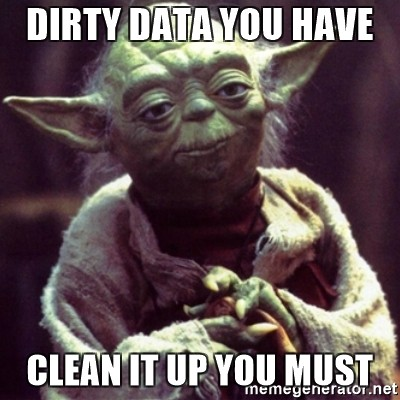
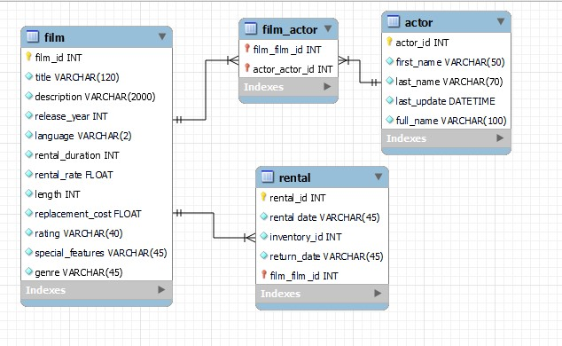

# Proyecto de limpieza y transformación de datos

## Este proyecto tiene tres pasos.
    
    Limpieza de 7 csv.
    Crear base de datos SQL
    Consultas en la base de datos en SQL

## Distribucion:
    
    code: Jupyter Notebook with the data cleaning and export csv code.
    data: Original csv
    export_csv: csv despues de limpieza.
    Querys_MySQL: Creacion de base de datos y 10 consultas.

## Paso 1: Limpieza de datos :magic_wand:

---

He creado una funcion de limpieza automatica para que:
    La informacion aparezca en minuscula con la primera letra en mayuscula.
    Rellenar nulos
    Cambiar a tipo fecha algunas columnas.

Modificación de los DataFrame para adecuar la informacion a la base de datos.

## Paso 2: Base de datos en SQL

---

### Relacion actor-film

Usar old_hdd como nexo entre actor actor y film para almacenar las foreign key.
Añadir el genero de la pelicula a film desde category

### Relacion film-rental

Inicialmente inventory era la relacion con rental, he añadido toda la informacion en rental.
De esta relacion he sacado las siguientes conclusiones:

    En total hay 1000 titulos registrados.
    Solo se han metido datos de 212 titulos en inventario.
    En el inventario deberia haber 4600 registros, ya que hay peliculas con varias copias en stock.
    De los 4600 solo tenemos registrados 1000.

Acciones tomadas con la informacion de la que disponemos:

    Eliminar en rental todas las filas de las que no tengamos informacion.
    Rehacer el indice de alquileres.

La conclusion es que necesitariamos rellenar el resto del inventario a mano, una vez dispongamos de esta información.

El resultado final es el siguiente: :boom: :boom:

# Paso 3: Querys en SQL

Query 1 - Actor con mas películas

Query 2 - Pelicula con mas actores

Query 3 - Buscar un titulo aleatorio dentro del listado de peliculos

Query 4 - Informacion sobre película aleatoria. Genero, rating, longuitud y listado de actores

Query 5 - Buscar tres actores aleatorios

Query 6 - ¿En que películas han trabajado tres actores aleatorios?

Query 7 - ¿Cuales son los titulos de las peliculas que tengo en stock?

Query 8 - ¿Cuantas películas se alquilaron en 2005?

Query 9 - ¿Cual es la película que mas veces ha sido alquilada?

Query 10 - ¿Cuales han sido las películas que nunca han sido alquiladas?